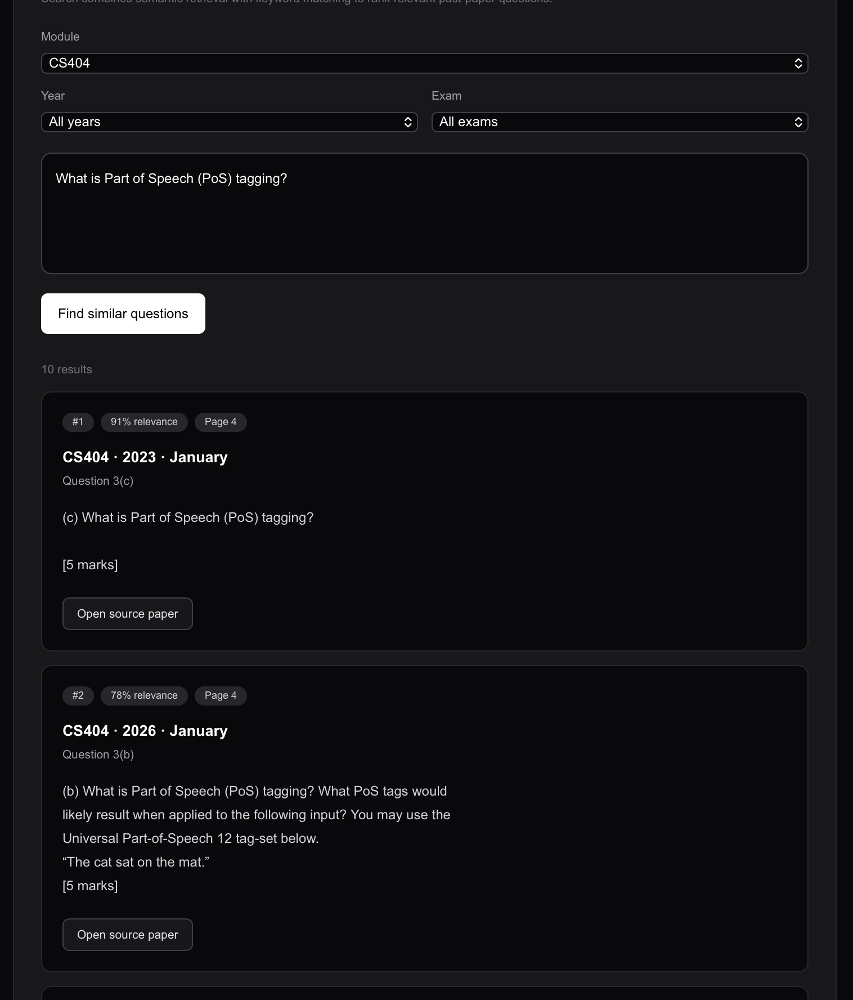
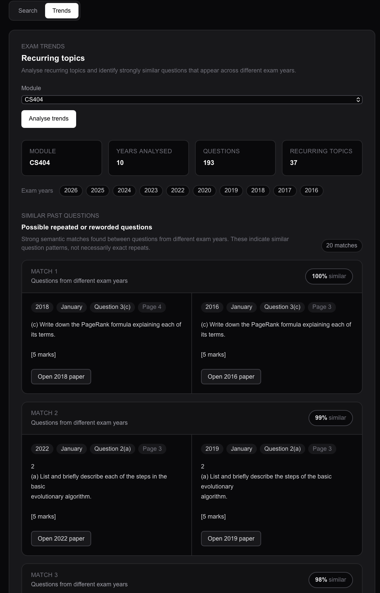
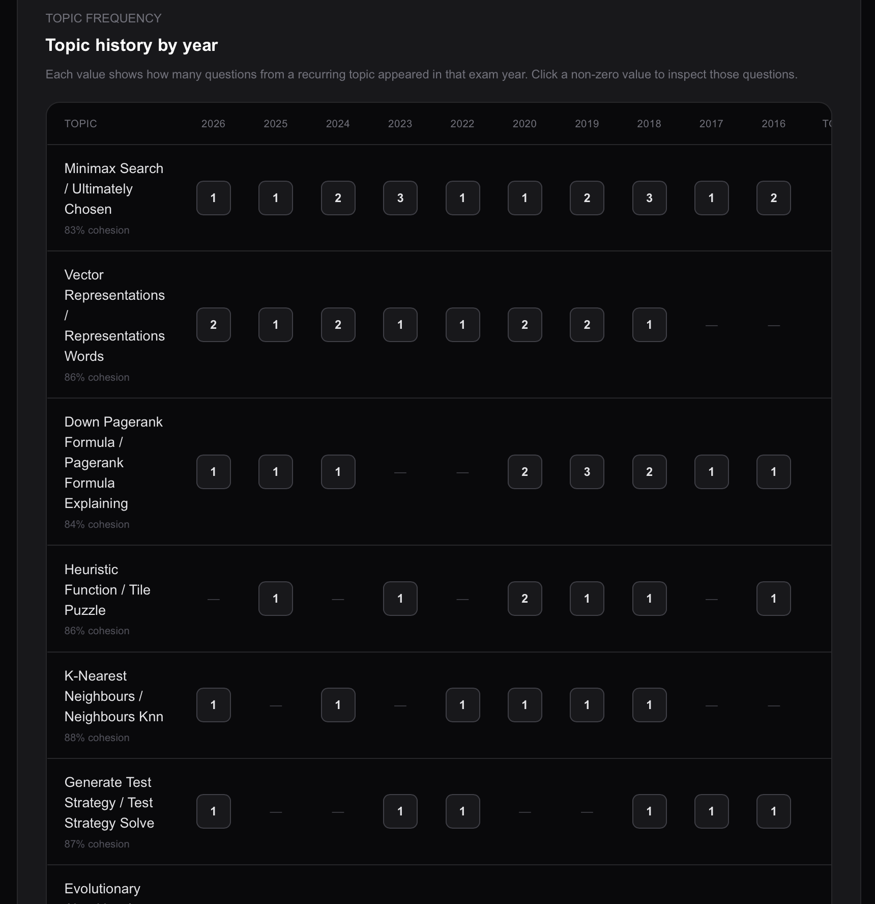
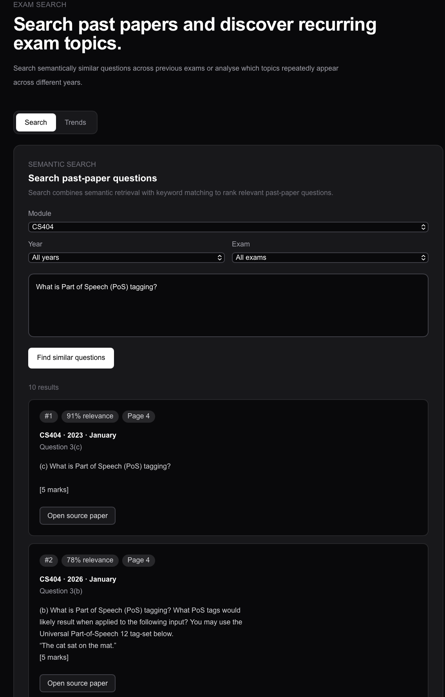
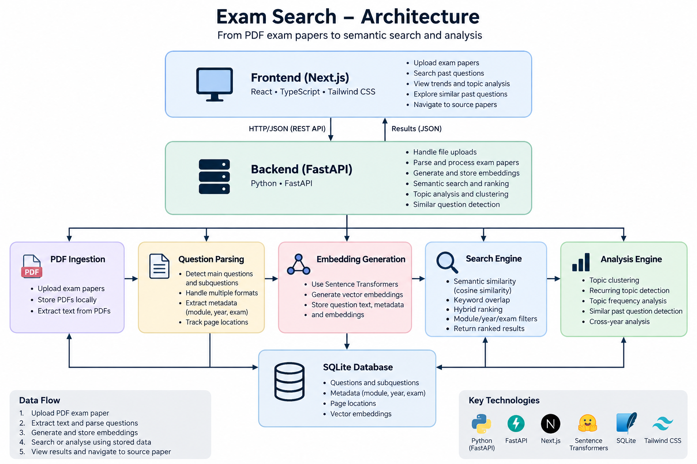

# Exam Search

Exam Search is a full-stack application for searching and analysing university past exam papers.

It extracts questions from uploaded PDF exam papers, generates semantic embeddings, and allows users to search for conceptually similar questions rather than relying only on exact keyword matches.

The application also analyses historical exam papers to identify recurring topics, topic frequency across years, and questions that may have been repeated or reworded.

## Screenshots

### Semantic Search

Search past exam questions using natural-language queries and rank results by relevance.



### Recurring Topic Analysis

Analyse past papers to identify topics that have appeared across multiple exam years.



### Topic Frequency Dashboard

Compare how often recurring topics appear across different exam years.



### Similar Past Questions

Identify questions from different years that are semantically similar or potentially reworded versions of one another.



## Features

### PDF Exam Paper Upload

Upload exam papers with:

- Module
- Year
- Exam session
- PDF file

Exam Search automatically extracts and parses main questions and subquestions from the uploaded paper.

The parser supports multiple exam-paper formats rather than relying on one fixed question structure.

### Semantic Exam Search

Search past exam questions using natural language.

Search combines:

- Sentence-transformer embeddings
- Cosine similarity
- Keyword overlap
- Module, year, and exam filters

This allows a query to find relevant questions even when the wording differs from the original exam question.

### Recurring Topic Analysis

Exam Search groups semantically related questions from different exam years to identify topics that appear repeatedly.

For each recurring topic, the application displays:

- Topic name
- Number of matching questions
- Number of years in which the topic appeared
- Years of appearance
- Topic cohesion
- Questions associated with the topic

### Topic Frequency Dashboard

The trend dashboard provides a topic-by-year frequency matrix.

This makes it possible to quickly see which topics have appeared repeatedly and how their frequency has changed across exam years.

Individual cells can be selected to inspect the questions responsible for that topic/year combination.

### Similar Past Questions

Exam Search compares questions across different exam years to identify strongly similar questions.

This can highlight questions that may have been repeated or substantially reworded.

The feature uses semantic similarity rather than exact text matching, allowing it to detect questions that test the same concept using different wording.

### Source Paper Navigation

Search results, trend results, and similar-question matches link back to the original uploaded PDF.

Where page information is available, the application opens the source paper at the relevant page.

### Multi-Module Support

The application is not hardcoded for a particular university module.

Modules, years, and exam sessions are derived dynamically from uploaded papers, allowing the same system to analyse different subjects.

## Tech Stack

### Backend

- Python
- FastAPI
- SQLite
- Sentence Transformers
- NumPy
- PDF text extraction

### Frontend

- Next.js
- React
- TypeScript
- Tailwind CSS

## Architecture



Exam Search separates the user interface, API layer, document-processing pipeline, semantic search, analysis engine, and persistent storage.

The Next.js frontend communicates with the FastAPI backend through REST API requests. The backend handles PDF ingestion, question parsing, embedding generation, semantic search, recurring-topic analysis, and similar-question detection.

SQLite provides persistent storage for extracted questions, exam metadata, page locations, and vector embeddings.

## How It Works

When a paper is uploaded:

1. The PDF is stored locally.
2. Text is extracted from the document.
3. Main questions and subquestions are detected.
4. Each subquestion is converted into a semantic embedding.
5. Questions, metadata, page numbers, and embeddings are stored in SQLite.

Stored embeddings are reused for search and analysis rather than being regenerated for every request.

### Search Flow

When a user searches for a question:

1. The search query is converted into an embedding.
2. Questions are restricted to the selected module and optional year/exam filters.
3. Cosine similarity is calculated between the query and stored question embeddings.
4. Keyword overlap is calculated between the query and each candidate question.
5. Semantic similarity and keyword similarity are combined into a hybrid relevance score.
6. Results are ranked and returned to the frontend.
7. Users can navigate from a result back to its original exam paper.

### Analysis Flow

For historical analysis:

1. Stored question embeddings are loaded for the selected module.
2. Semantically related questions are grouped into recurring topics.
3. Topics appearing across multiple years are identified.
4. Topic frequency is calculated across exam years.
5. Question pairs from different years are compared to identify strongly similar or potentially reworded questions.
6. Results are presented through the Trends dashboard.

## Search Ranking

Search uses a hybrid relevance score consisting of:

```text
80% semantic similarity
20% keyword overlap
```

Semantic similarity allows conceptually related questions to match even when their wording differs.

Keyword overlap helps preserve relevance for important technical terms.

Search is performed within the selected module so unrelated subjects do not compete with each other.

## Topic Detection

Recurring topics are detected by clustering questions using their stored semantic embeddings.

Questions are compared against topic centroids using cosine similarity.

A topic must contain questions from multiple exam years before it is considered a recurring historical topic.

Topic labels are generated automatically from recurring phrases and technical terms found within the clustered questions.

## Similar Question Detection

Similar Past Questions uses a stricter semantic comparison than topic clustering.

Every unique pair of questions from different years is compared using cosine similarity.

This distinguishes between:

```text
Recurring topic:
"These questions discuss the same general concept."

Similar past question:
"These questions are strongly similar and may be reworded versions of one another."
```

This feature identifies possible repeated questions without assuming that semantic similarity proves an exam question was intentionally reused.

## Project Structure

```text
exam-search/
├── backend/
│   ├── main.py
│   ├── pdf_parser.py
│   ├── question_parser.py
│   ├── search_engine.py
│   ├── trend_engine.py
│   └── requirements.txt
│
├── frontend/
│   └── app/
│       └── page.tsx
│
├── docs/
│   └── images/
│       ├── architecture.png
│       ├── search-results.png
│       ├── trends.png
│       ├── topic-frequency.png
│       └── similar-questions.png
│
├── storage/
├── papers.db
└── README.md
```

## Running Locally

### Backend

From the project root:

```bash
cd backend
```

Create a virtual environment if one does not already exist:

```bash
python3 -m venv .venv
```

Activate it:

```bash
source .venv/bin/activate
```

Install dependencies:

```bash
pip install -r requirements.txt
```

Start the FastAPI server:

```bash
python -m uvicorn main:app --reload
```

The backend runs at:

```text
http://127.0.0.1:8000
```

FastAPI API documentation is available at:

```text
http://127.0.0.1:8000/docs
```

### Frontend

Open another terminal:

```bash
cd frontend
```

Install dependencies:

```bash
npm install
```

Start the Next.js development server:

```bash
npm run dev
```

Open:

```text
http://localhost:3000
```

## Current Status

Exam Search currently supports:

- Multi-module exam paper uploads
- Automatic question parsing across different exam formats
- Persistent SQLite storage
- Sentence Transformer embeddings
- Hybrid semantic and keyword search
- Dynamic module/year/exam filtering
- Recurring topic detection
- Topic frequency analysis
- Cross-year similar-question detection
- PDF source navigation
- Question page tracking
- Duplicate upload protection
- Paper deletion
- Cleaned question presentation while preserving mark information

## Future Improvements

Potential future improvements include:

- Improved automatic topic naming
- More advanced ranking and reranking
- Support for additional document formats
- Improved handling of mathematical PDF encoding
- Automated backend and parser tests
- Deployment
- Authentication and user-specific paper libraries
- Additional exam analytics and visualisations

## Disclaimer

Exam Search analyses historical exam papers and semantic similarity between questions.

Recurring topics and similar-question matches are intended as study and analysis tools. They should not be interpreted as predictions of future exam questions.